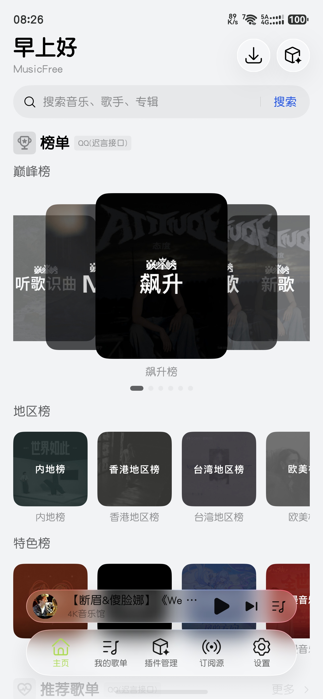
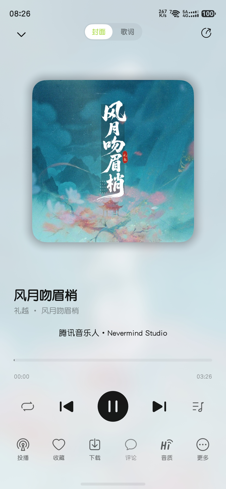
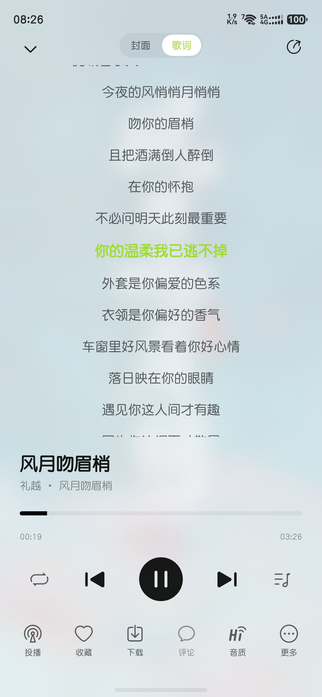
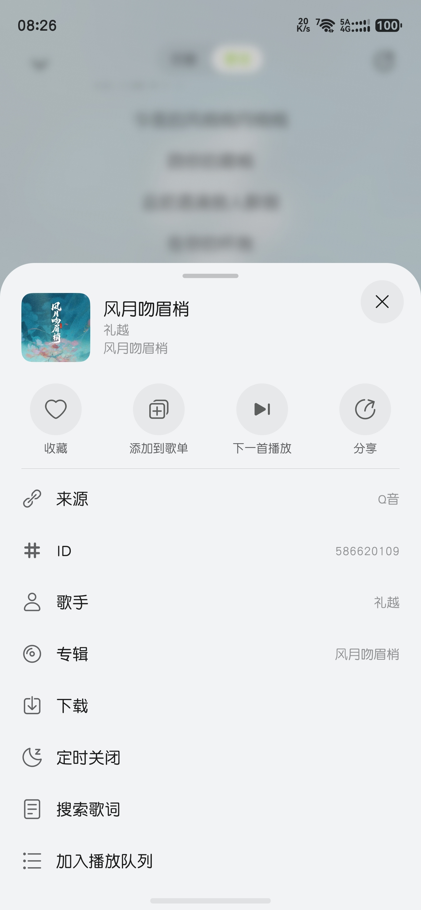
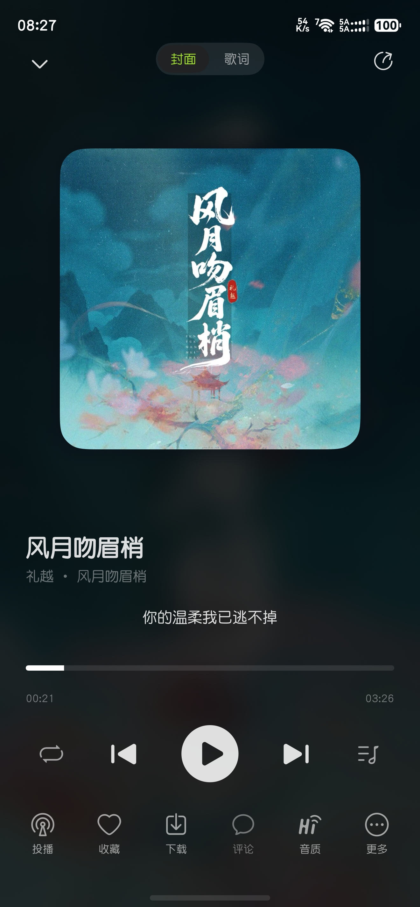

# MusicFreeOH

MusicFreeOH 是开源插件化音乐播放器 [MusicFree](https://github.com/maotoumao/MusicFree)（作者：猫头猫）的 **HarmonyOS（鸿蒙）移植版**，使用 ArkTS / ArkUI 原生开发。

> 本项目移植于猫头猫的 MusicFree，感谢原项目提供的优秀设计与插件生态。
> 原项目仓库地址：https://github.com/maotoumao/MusicFree

## 功能特性

- **插件化音源**：兼容 MusicFree 插件协议（`.js` 插件脚本），通过内置 WebView 引擎执行插件，一个插件即可接入一个音源
- **订阅源**：支持网络 / 本地导入订阅源（`.json` 插件列表、`.js` 单插件），一键同步更新，支持批量管理（全选 / 导出 / 删除）
- **搜索与播放**：聚合多插件搜索、歌单、榜单、专辑、艺术家，支持音质选择、播放队列、单曲循环 / 列表循环 / 随机播放
- **支持自动换源和手动换源**：不仅支持原版的自动换源功能，还支持手动批量更换音源，避免音源失效无法播放的问题。
- **歌词**：歌词解析与滚动展示、翻译歌词、本地歌词关联
- **下载管理**：多任务并行下载、下载进度与状态展示、本地音乐扫描（内嵌封面 / 歌词支持）
- **我的歌单**：创建 / 重命名 / 删除歌单，批量操作歌曲
- **设置中心**：缓存管理（音乐缓存上限、分类清理缓存）、关于页面、免责声明等

## 技术栈

| 依赖 | 说明 |
| --- | --- |
| ArkTS / ArkUI（`@ComponentV2`） | 应用主体，状态驱动 V2 模型 |
| HDS 组件库（`@kit.UIDesignKit`） | 标题栏 / 底部页签 / 列表卡片等系统级 UI 组件 |
| WebView（`@ohos.web.webview`） | MusicFree 插件脚本执行引擎 |
| [@xiaoye/date](https://ohpm.openharmony.cn/#/cn/detail/@xiaoye%2Fdate) | 日期处理 |
| [@keke/color-picker](https://ohpm.openharmony.cn/#/cn/detail/@keke%2Fcolor-picker) | 颜色选择器（外观设置主题色取色，API 26 以下替代系统 `HdsColorPicker`） |

## 软件截图

<table>
  <tr>
    <td></td>
    <td></td>
    <td></td>
    <td></td>
  </tr>
  <tr>
    <td></td>
    <td></td>
    <td></td>
    <td></td>
  </tr>
</table>

## 环境与构建

1. 安装 [DevEco Studio](https://developer.huawei.com/consumer/cn/deveco-studio/)（5.0 及以上版本），并配置 HarmonyOS SDK
2. 使用 DevEco Studio 打开本项目根目录，等待 ohpm 依赖同步完成
3. 连接 HarmonyOS NEXT 设备或启动模拟器，配置签名后即可运行调试

命令行构建：

```bash
hvigorw assembleHap
```

## 免责声明

本软件仅供交流与学习使用，是一款开源、免费的本地音乐播放工具，请勿相信付费渠道资源。软件本身不内置、不提供任何音频资源，也不提供任何受版权保护的音乐内容。所有音源均来自第三方插件，插件由第三方开发者维护，其内容的合法性、准确性与版权状况由相应提供方负责，与本软件无关。

请遵守您所在地区的法律法规，合理、适度地使用本软件。因下载或使用本软件而产生的任何直接或间接责任，均由使用者自行承担。

## 开源许可

本项目基于 [AGPL-3.0](https://www.gnu.org/licenses/agpl-3.0.html) 协议开源，同时遵循原项目 MusicFree 的开源协议要求。

## 致谢

- [MusicFree](https://github.com/maotoumao/MusicFree) 及其作者 **猫头猫** —— 本项目移植自该项目
- 所有 MusicFree 插件开发者
